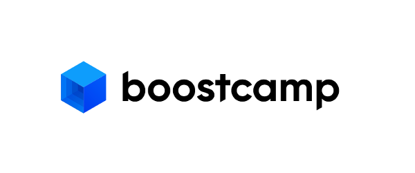
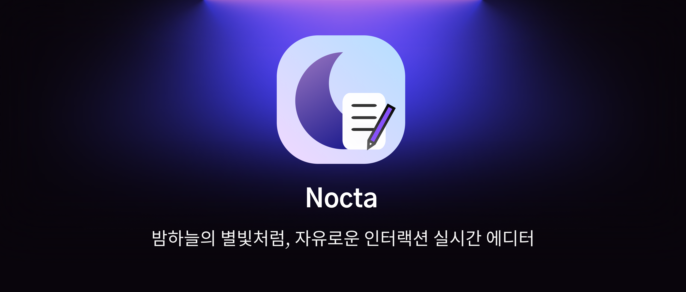

[![Typing SVG](https://readme-typing-svg.demolab.com?font=Fira+Code&duration=2000&pause=200&color=EFEFEF&multiline=true&repeat=false&width=1000&height=85&lines=%EC%82%AC%EC%9A%A9%EC%9E%90+%EA%B2%BD%ED%97%98+%EA%B0%9C%EC%84%A0%EC%9D%84+%EC%B5%9C%EC%9A%B0%EC%84%A0%EC%9C%BC%EB%A1%9C+%EC%83%9D%EA%B0%81%ED%95%98%EB%8A%94+%ED%94%84%EB%A1%A0%ED%8A%B8%EC%97%94%EB%93%9C+%EA%B0%9C%EB%B0%9C%EC%9E%90%EC%9E%85%EB%8B%88%EB%8B%A4.;%EB%AA%A8%EB%A5%B4%EB%8A%94+%EA%B2%83%EC%9D%84+%EC%A7%88%EB%AC%B8%ED%95%98%EB%8A%94+%EA%B2%83%EC%9D%84+%EB%91%90%EB%A0%A4%EC%9B%8C%ED%95%98%EC%A7%80+%EC%95%8A%EA%B3%A0+%EC%83%88%EB%A1%9C%EC%9A%B4+%EA%B8%B0%EC%88%A0%EC%9D%84+%EA%BE%B8%EC%A4%80%ED%9E%88+%ED%95%99%EC%8A%B5%ED%95%98%EA%B3%A0+%EC%84%B1%EC%9E%A5%ED%95%A9%EB%8B%88%EB%8B%A4.;%ED%8E%98%EC%96%B4+%ED%94%84%EB%A1%9C%EA%B7%B8%EB%9E%98%EB%B0%8D%2C+%EC%BD%94%EB%93%9C+%EB%A6%AC%EB%B7%B0%2C+%EC%86%8C%ED%94%84%ED%8A%B8%EC%8A%A4%ED%82%AC+%EC%8A%B5%EB%93%9D%EC%9D%84+%ED%86%B5%ED%95%B4+%EC%A7%80%EC%86%8D%EA%B0%80%EB%8A%A5%ED%95%9C+%EA%B0%9C%EB%B0%9C%EC%9E%90%EA%B0%80+%EB%90%98%EA%B8%B0+%EC%9C%84%ED%95%B4+%EB%85%B8%EB%A0%A5%ED%95%A9%EB%8B%88%EB%8B%A4.)](https://git.io/typing-svg)

## 🛠️ Tech Stacks 🛠️

### Frontend

### Backend

### Tools

## 📗 Studying 📗

## 🚀 Experience 🚀

### 카카오페이 프론트엔드 인턴
*2025.04 - 진행중*

### 네이버 부스트캠프 Web 9기 (FE)
*2024.06 - 2025.02*

## 💻 Project 💻

### Nocta: 실시간 동시편집 마크다운 에디터
*2024.11 - 2025.01*

팀 프로젝트(FE: 3, BE: 1)  
#### **마크다운 에디터** 및 **CRDT 라이브러리** 개발 담당

---

